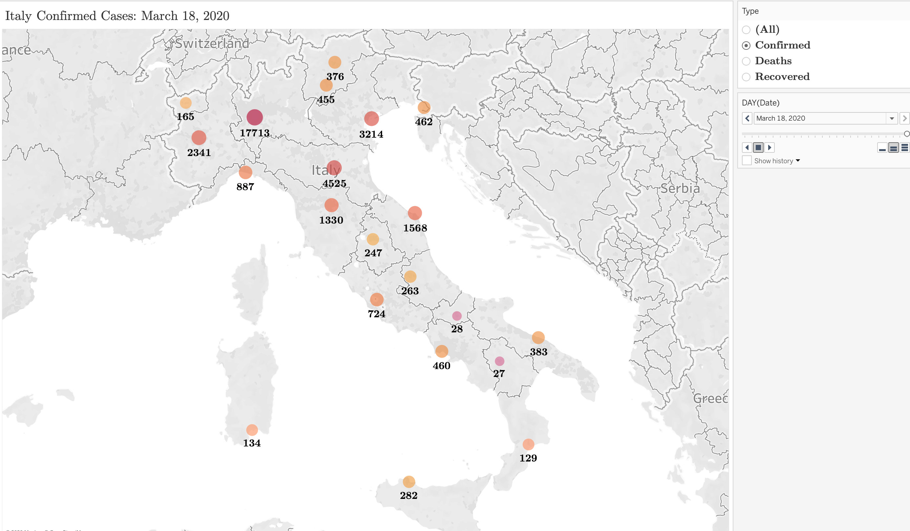
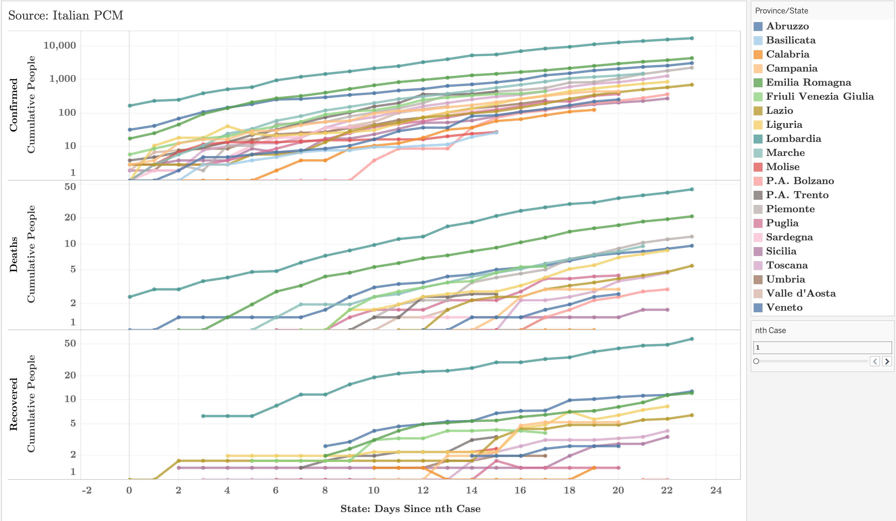
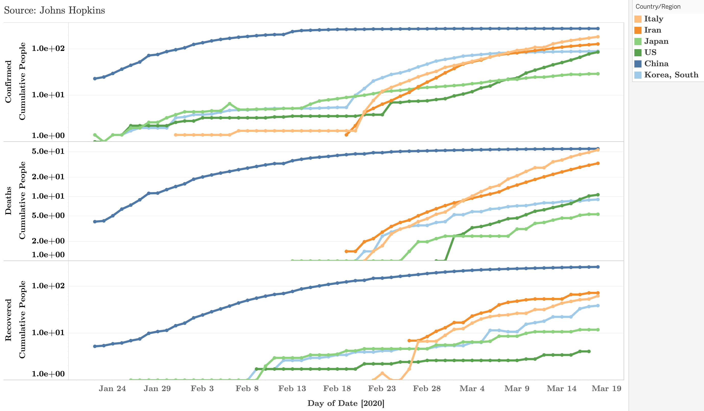

# COVID-19 Visualizations with Tableau
Tableau Analysis of JHU and Italian PCM data

Data is downloaded from [JHU CSSE](https://github.com/CSSEGISandData/COVID-19) and the [Italian PCM](https://github.com/pcm-dpc/COVID-19?fbclid=IwAR3ZdlaE7ro2Jj712CpHeEdyYyQutUtAtzPNWH2PnALM-q0LDLtpLYzJcQk).

You can update the data using the included bash script i.e. running `bash update_data.sh`. The first time doing this, you also need to give permission to run the script by running the following first `chmod +x update_data.sh`.

The data is cleaned using [Tableau Prep](https://www.tableau.com/products/prep) and visualized using [Tableau Desktop](https://www.tableau.com/products/desktop). The files are included with `clean_corona.tfl` and `corona_analysis.twb`, respectively. When you open the Tableau Prep flow and the Tableau Desktop notebook for the first time, it will say they can not find the relevant datafiles: you need to reset the location of the `corona_all.csv` file on *your* computer in `corona_analysis.twb`. You need to do the analogous thing for the four raw datafiles in `clean_corona.tfl`. 

You *do not* need to run the Tableau Prep flow to in order to visualize the data: To visualize the data you *only need* `corona_all.csv` and `corona_analysis.twb`.

To clean the data, you need to first pull the most updated raw data files using `update_data.sh`. Then, in the Tableau Prep flow, move the newest dates to the pivoted columns in the "pivot" step.

Both Tableau Prep and Tableau Desktop are free for academics with an .edu email [here](https://www.tableau.com/academic/students).

**Maintainer:** X.Y. Han, Cornell University ORIE

## Examples
Below are a few screenshots of visualizations in the Tableau Notebook.

(***Movies:*** There are also two movies (`.mov` files) created with the notebook in the `\movies` folder of this repository.)

